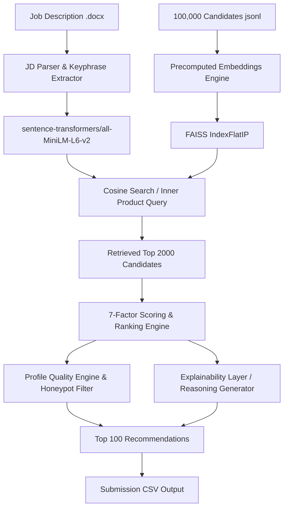

# TalentMind-AI
# TalentMind AI - Intelligent Candidate Discovery Platform

Intelligent Candidate Discovery & Ranking Platform built for the Redrob H2S Challenge. The system retrieves and ranks candidates from a pool of 100,000 profiles against a job description, delivering the Top 100 recommended candidates in under 30 seconds on CPU.

---

## 🚀 Key Features

* **Two-Stage Hybrid Pipeline**: Combines FAISS-based semantic vector retrieval with a robust 7-factor scoring and ranking model.
* **Honeypot & Trap Immunity**: Proactively filters out keyword-stuffed profiles, empty applications, and subtly impossible "honeypots" (such as timeline or skill duration mismatches).
* **Deterministic Tie-Breaking**: Ranks candidates with identical scores based on ascending alphabetical order of their `candidate_id`.
* **Explainable AI Layer**: Automatically generates a 1-2 sentence, non-templated reasoning block for each candidate highlighting strengths, experience, location, and potential fit gaps.
* **Interactive Streamlit Dashboard**: Provides recruiters with an elegant UI to upload JDs, run discovery, inspect scores, read reasoning cards, and download submission CSVs.

---

## 🛠️ System Architecture



---

## 📈 Ranking Methodology (Scoring Framework)

The final score is normalized to a `[0, 100]` range and computed as follows:

| Factor | Weight | Scoring Logic |
| :--- | :--- | :--- |
| **Semantic Similarity** | 35% | Cosine similarity between JD and candidate text representation via FAISS. |
| **Skill Match** | 20% | Substring match against required/preferred skills, weighted by candidate proficiency. |
| **Experience Match** | 15% | Score based on target years (5-9), career tenure, and penalties for gaps & consulting firms. |
| **Project Relevance** | 10% | Semantic keyword frequency check across candidate's past work descriptions. |
| **Behavioral Signals** | 10% | Response rate, response time, login activity, and interview completion rates. |
| **Education Match** | 5% | Degree field relevance combined with university tiering (Tier 1/2/3/4). |
| **Profile Quality** | 5% | Checks for empty profiles, keyword stuffers, and invalid salary ranges. |

* **Honeypot Penalty**: Profiles with impossible timelines (e.g. job duration exceeding date ranges) or expert skills with 0 duration have their Quality Score forced to `0.0` and are completely filtered out of the top rankings.

---

## 📊 Sample Output Format

```csv
candidate_id,rank,score,reasoning
CAND_0068134,1,92.4,"Aarav Sen is an excellent fit as a Senior Applied ML Engineer with 7.5 years of experience, showing strong hands-on experience in embeddings, FAISS, and python. Excellent recruiter response rate (95%) indicates high availability."
CAND_0012945,2,91.8,"Meera Nair is a strong fit as a Machine Learning Engineer with 6.2 years of experience, demonstrating core expertise in vector databases and python. Active GitHub contributions (score: 84) confirm solid code quality."
```
